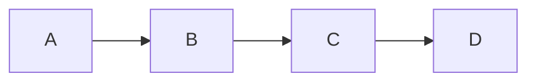
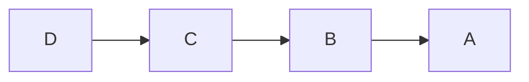

# Aula 6 - Explorando Objetos e Métodos Built-In do JavaScript
## aTip Learn - Lógica de Programação com JavaScript

## Resumo da Aula

Nesta aula, exploraremos os objetos built-in do JavaScript: Maps e Sets para armazenar coleções de valores eficientemente. Aprenderemos a utilizar pilhas e filas para resolver problemas que envolvem sequências de elementos organizados, como histórico de navegação e gerenciamento de tarefas.

## Objetivos

- Compreender o que são pilhas e filas.
- Explorar métodos e propriedades de arrays e strings.
- Utilizar objetos Map e Set para armazenar coleções de valores.
- Resolver problemas simples envolvendo, pilhas, filas, mapas e sets.

## Pilhas e Filas

Pilhas e filas são estruturas de dados que armazenam coleções de elementos, permitindo a inserção e remoção de elementos de forma organizada. Algumas linguagens de programação possuem implementações específicas para pilhas e filas, mas em JavaScript, utilizamos arrays para obter o mesmo tipo de comportamento dessas estruturas.

### Filas

Uma fila é uma estrutura de dados que segue o princípio FIFO (First In, First Out), ou seja, o primeiro elemento a ser inserido também será o primeiro a ser removido. Ou seja, os elementos são removidos na mesma ordem em que são inseridos na fila.

A forma mais simples de compreender o comportamento de uma fila é observar o comportamento de uma fila de pessoas em um banco. As pessoas entram e tomam seu lugar na fila mantendo a ordem de chegada. Conforme o atendente chama as pessoas, elas saem da fila na mesma ordem em que entraram.

Para simularmos uma fila utilizando um array na linguagem JavaScript, utilizamos o método `push` para adicionar elementos ao final do array e o método `shift` para remover o primeiro elemento do array.

```javascript
const fila = [];

fila.push('A');
fila.push('B');
fila.push('C');

console.log(fila.shift()); // A
console.log(fila.shift()); // B
console.log(fila.shift()); // C
```

**Ordem de Inserção:**



**Ordem de Remoção:**


### Pilhas

Uma pilha é uma estrutura de dados que segue o princípio LIFO (Last In, First Out), ou seja, o último elemento a ser inserido será o primeiro a ser removido. Ou seja, os elementos são removidos na ordem inversa em que são inseridos na pilha.

Para compreender o funcionamento da pilha, imagine uma pilha de pratos em um restaurante self-service. Os pratos são empilhados uns sobre os outros, o primeiro prato a ser colocado na pilha ficará abaixo de todos os outros pratos. Quando um cliente pega um prato, ele retira o prato que está no topo da pilha. Quando um novo prato é inserido, ele também é colocado no topo da pilha.

Para simularmos uma pilha utilizando um array na linguagem JavaScript, utilizamos o método `push` para adicionar elementos ao final do array e o método `pop` para remover o último elemento do array.

```javascript
const pilha = [];

pilha.push('A');
pilha.push('B');
pilha.push('C');

console.log(pilha.pop()); // C
console.log(pilha.pop()); // B
console.log(pilha.pop()); // A
```

**Ordem de Inserção:**


**Ordem de Remoção:**



### Problemas com Pilhas e Filas

** 1. Histórico de Navegação **

Crie um conjunto de funções para simular o comportamento de um histórico de navegação de um navegador. A função `navegarPara` deve adicionar uma nova página ao histórico. A função `voltar` deve remover a última página visitada do histórico e retornar a página anterior. E a função `paginaAtual` deve retornar a página atual.

```javascript
const historico = [];

function navegarPara(pagina) {
  historico.push(pagina);
}

function voltar() {
  historico.pop();
}

function paginaAtual() {
  return historico[historico.length - 1];
}

navegarPara('https://google.com');
navegarPara('https://facebook.com');
console.log(paginaAtual()); // https://facebook.com
voltar();
console.log(paginaAtual()); // https://google.com
```

**2. Fila de Atendimento**

Crie um programa para controlar o painel de senhas de um banco. Esse programa deve possuir as seguintes funções:

- `gerarSenha`: Gera uma nova senha para o cliente e adiciona à fila de atendimento.
- `chamarProximo`: Chama o próximo cliente da fila para ser atendido, sem removê-lo da fila.
- `removerProximo`: Remove o próximo cliente da fila.

```javascript
const filaAtendimento = [];

function gerarSenha() {
  const senha = Math.floor(Math.random() * 1000);
  filaAtendimento.push(senha);
  console.log(`Senha gerada: ${senha}`);
}

function chamarProximo() {
  console.log(`Próximo cliente: ${filaAtendimento[0]}`);
}

function removerProximo() {
  filaAtendimento.shift();
}

gerarSenha(); // Senha gerada: 123
gerarSenha(); // Senha gerada: 456
chamarProximo(); // Próximo cliente: 123
removerProximo();
chamarProximo(); // Próximo cliente: 456
```

**3. Sequência de Parênteses**

Dada uma sequência de parênteses, crie uma função para determinar se a sequência é válida. Uma sequência de parênteses é válida se, para cada parêntese de abertura, existe um parêntese de fechamento correspondente e na ordem correta.

```javascript
function sequenciaValida(sequencia) {
  const pilha = [];

  for (let i = 0; i < sequencia.length; i++) {
    if (sequencia[i] === '(') {
      pilha.push('(');
    } else if (sequencia[i] === ')') {
      if (pilha.length === 0) {
        return false;
      }
      pilha.pop();
    }
  }

  return pilha.length === 0;
}

console.log(sequenciaValida('()')); // true
console.log(sequenciaValida('(()')); // false
console.log(sequenciaValida(')(')); // false
console.log(sequenciaValida('()()')); // true
```

## Objetos Map e Set

Os objetos `Map` e `Set` são coleções de valores que permitem armazenar e consultar dados de forma eficiente. Ambos os objetos utilizam uma estrutura de dados conhecida como `hash map`, que permite consultar valores armazenados em uma coleção de forma rápida.

### Set

O objeto `Set` é uma coleção de valores únicos, ou seja, não permite a inserção de valores duplicados. Para adicionar um novo valor ao conjunto, utilizamos o método `add`. Para verificar se um valor está presente no conjunto, utilizamos o método `has`. Para remover um valor do conjunto, utilizamos o método `delete`. E para obter o tamanho do conjunto, utilizamos a propriedade `size`.

```javascript
const conjunto = new Set();

conjunto.add('A');
conjunto.add('B');
console.log(conjunto.size); // 2
console.log(conjunto.has('A')); // true
conjunto.add('A');
console.log(conjunto.size); // 2
conjunto.delete('A');
console.log(conjunto.size); // 1
```

A habilidade do objeto `Set` de armazenar valores únicos é útil em diversos tipos de problemas, como a remoção de elementos duplicados de um array.

```javascript
const numeros = [1, 2, 3, 1, 2, 3];
const numerosUnicos = new Set(numeros);

for (const numero of numerosUnicos) {
  console.log(numero);
}
```

### Map

O objeto `Map` é uma coleção de pares chave-valor, onde cada chave é única e associada a um valor específico. Para adicionar um novo par chave-valor ao mapa, utilizamos o método `set`. Para verificar se uma chave está presente no mapa, utilizamos o método `has`. Para obter o valor associado a uma chave, utilizamos o método `get`. E para remover um par chave-valor do mapa, utilizamos o método `delete`. E para obter o tamanho do mapa, utilizamos a propriedade `size`.

```javascript
const mapa = new Map();

mapa.set('A', 1);
mapa.set('B', 2);
console.log(mapa.size); // 2
console.log(mapa.has('A')); // true
console.log(mapa.get('A')); // 1
mapa.set('A', 3);
console.log(mapa.get('A')); // 3
mapa.delete('A');
console.log(mapa.size); // 1
```

A habilidade do objeto `Map` de associar chaves a valores é útil em diversos tipos de problemas, como a contagem de ocorrências de elementos em um array.

```javascript
const letras = ['A', 'B', 'A', 'C', 'B', 'A'];
const contagemLetras = new Map();

for (const letra of letras) {
  if (contagemLetras.has(letra)) {
    const contagemAtual = contagemLetras.get(letra);
    contagemLetras.set(letra, contagemAtual + 1);
  } else {
    contagemLetras.set(letra, 1);
  }
}

for (const [letra, contagem] of contagemLetras) {
  console.log(`${letra}: ${contagem}`);
}
```

### Problemas com Map e Set

**1. Contagem de Palavras**

Dada uma frase, crie um programa para contar a quantidade de vezes que cada palavra aparece na frase.

```javascript
function contagemPalavras(frase) {
  const palavras = frase.split(' ');
  const contagem = new Map();

  for (const palavra of palavras) {
    if (contagem.has(palavra)) {
      const contagemAtual = contagem.get(palavra);
      contagem.set(palavra, contagemAtual + 1);
    } else {
      contagem.set(palavra, 1);
    }
  }

  return contagem;
}

const frase = 'o rato roeu a roupa do rei de roma';
const contagem = contagemPalavras(frase);

for (const [palavra, quantidade] of contagem) {
  console.log(`${palavra}: ${quantidade}`);
}
```

**2. Sequência Aleatória de 0 a 10**

Crie um programa para gerar uma sequência aleatória utilizando todos os números de 1 a 10, sem repetições.

```javascript
const sequencia = new Set();

while (sequencia.size < 10) {
  const numero = Math.floor(Math.random() * 10) + 1;
  sequencia.add(numero);
}

for (const numero of sequencia) {
  console.log(numero);
}
```

**3. Verificação de Anagramas**

Dadas duas palavras, crie uma função para verificar se as palavras são anagramas, ou seja, se possuem as mesmas letras, mas em ordem diferente.

```javascript
function contarLetras(palavra) {
  const contagem = new Map();

  for (const letra of palavra) {
    if (contagem.has(letra)) {
      const contagemAtual = contagem.get(letra);
      contagem.set(letra, contagemAtual + 1);
    } else {
      contagem.set(letra, 1);
    }
  }

  return contagem;
}

function saoAnagramas(palavra1, palavra2) {
  const contagem1 = contarLetras(palavra1);
  const contagem2 = contarLetras(palavra2);

  if (contagem1.size !== contagem2.size) {
    return false;
  }

  for (const [letra, contagem] of contagem1) {
    if (contagem2.get(letra) !== contagem) {
      return false;
    }
  }

  return true;
}
```

